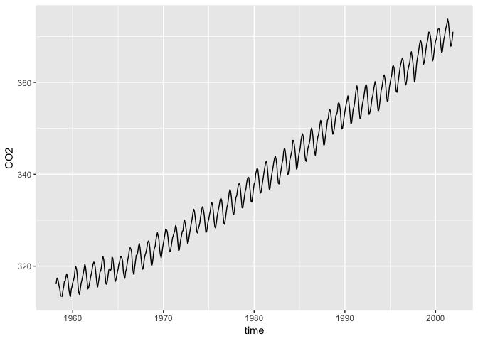

Les séries témporelles et reproductibilité
================
Yvonne Uwituze
2019-04-05

**Opérations sur les données temporelles**
==========================================

``` r
library(lubridate) # pour opérations sur séries temporelles
```

    ## 
    ## Attaching package: 'lubridate'

    ## The following object is masked from 'package:base':
    ## 
    ##     date

**Importation des données**
---------------------------

``` r
data_hawai <- read.csv("hawai.csv")
```

**Convertir les decimales en format de date**
---------------------------------------------

``` r
decimal<- data_hawai[,"time"]
date_decimal(decimal,tz="UTC")
```

    ##   [1] "1958-03-02 20:00:01 UTC" "1958-04-02 06:00:00 UTC"
    ##   [3] "1958-05-02 16:00:00 UTC" "1959-06-02 02:00:01 UTC"
    ##   [5] "1958-07-02 12:00:00 UTC" "1958-08-01 22:00:00 UTC"
    ##   [7] "1958-09-01 08:00:01 UTC" "1958-10-01 18:00:00 UTC"
    ##   [9] "1958-11-01 04:00:00 UTC" "1958-12-01 14:00:01 UTC"
    ##  [11] "1959-01-01 00:00:00 UTC" "1959-01-31 10:00:00 UTC"
    ##  [13] "1959-03-02 20:00:01 UTC" "1959-04-02 06:00:00 UTC"
    ##  [15] "1959-05-02 16:00:00 UTC" "1959-06-02 02:00:01 UTC"
    ##  [17] "1959-07-02 12:00:00 UTC" "1959-08-01 22:00:00 UTC"
    ##  [19] "1959-09-01 08:00:01 UTC" "1959-10-01 18:00:00 UTC"
    ##  [21] "1959-11-01 04:00:00 UTC" "1959-12-01 14:00:01 UTC"
    ##  [23] "1960-01-01 00:00:00 UTC" "1960-01-31 12:00:00 UTC"
    ##  [25] "1960-03-02 00:00:01 UTC" "1960-04-01 12:00:00 UTC"
    ##  [27] "1960-05-02 00:00:00 UTC" "1960-06-01 12:00:01 UTC"
    ##  [29] "1960-07-02 00:00:00 UTC" "1960-08-01 12:00:00 UTC"
    ##  [31] "1960-09-01 00:00:01 UTC" "1960-10-01 12:00:00 UTC"
    ##  [33] "1960-11-01 00:00:00 UTC" "1960-12-01 12:00:01 UTC"
    ##  [35] "1961-01-01 00:00:00 UTC" "1961-01-31 10:00:00 UTC"
    ##  [37] "1961-03-02 20:00:01 UTC" "1961-04-02 06:00:00 UTC"
    ##  [39] "1961-05-02 16:00:00 UTC" "1961-06-02 02:00:01 UTC"
    ##  [41] "1961-07-02 12:00:00 UTC" "1961-08-01 22:00:00 UTC"
    ##  [43] "1961-09-01 08:00:01 UTC" "1961-10-01 18:00:00 UTC"
    ##  [45] "1961-11-01 04:00:00 UTC" "1961-12-01 14:00:01 UTC"
    ##  [47] "1962-01-01 00:00:00 UTC" "1962-01-31 10:00:00 UTC"
    ##  [49] "1962-03-02 20:00:01 UTC" "1962-04-02 06:00:00 UTC"
    ##  [51] "1962-05-02 16:00:00 UTC" "1962-06-02 02:00:01 UTC"
    ##  [53] "1962-07-02 12:00:00 UTC" "1962-08-01 22:00:00 UTC"
    ##  [55] "1962-09-01 08:00:01 UTC" "1962-10-01 18:00:00 UTC"
    ##  [57] "1962-11-01 04:00:00 UTC" "1962-12-01 14:00:01 UTC"
    ##  [59] "1963-01-01 00:00:00 UTC" "1963-01-31 10:00:00 UTC"
    ##  [61] "1963-03-02 20:00:01 UTC" "1963-04-02 06:00:00 UTC"
    ##  [63] "1963-05-02 16:00:00 UTC" "1963-06-02 02:00:01 UTC"
    ##  [65] "1963-07-02 12:00:00 UTC" "1963-08-01 22:00:00 UTC"
    ##  [67] "1963-09-01 08:00:01 UTC" "1963-10-01 18:00:00 UTC"
    ##  [69] "1963-11-01 04:00:00 UTC" "1963-12-01 14:00:01 UTC"
    ##  [71] "1964-01-01 00:00:00 UTC" "1964-01-31 12:00:00 UTC"
    ##  [73] "1964-03-02 00:00:01 UTC" "1964-04-01 12:00:00 UTC"
    ##  [75] "1964-05-02 00:00:00 UTC" "1964-06-01 12:00:01 UTC"
    ##  [77] "1964-07-02 00:00:00 UTC" "1964-08-01 12:00:00 UTC"
    ##  [79] "1964-09-01 00:00:01 UTC" "1964-10-01 12:00:00 UTC"
    ##  [81] "1964-11-01 00:00:00 UTC" "1964-12-01 12:00:01 UTC"
    ##  [83] "1965-01-01 00:00:00 UTC" "1965-01-31 10:00:00 UTC"
    ##  [85] "1965-03-02 20:00:01 UTC" "1965-04-02 06:00:00 UTC"
    ##  [87] "1965-05-02 16:00:00 UTC" "1965-06-02 02:00:01 UTC"
    ##  [89] "1965-07-02 12:00:00 UTC" "1965-08-01 22:00:00 UTC"
    ##  [91] "1965-09-01 08:00:01 UTC" "1965-10-01 18:00:00 UTC"
    ##  [93] "1965-11-01 04:00:00 UTC" "1965-12-01 14:00:01 UTC"
    ##  [95] "1966-01-01 00:00:00 UTC" "1966-01-31 10:00:00 UTC"
    ##  [97] "1966-03-02 20:00:01 UTC" "1966-04-02 06:00:00 UTC"
    ##  [99] "1966-05-02 16:00:00 UTC" "1966-06-02 02:00:01 UTC"
    ## [101] "1966-07-02 12:00:00 UTC" "1966-08-01 22:00:00 UTC"
    ## [103] "1966-09-01 08:00:01 UTC" "1966-10-01 18:00:00 UTC"
    ## [105] "1966-11-01 04:00:00 UTC" "1966-12-01 14:00:01 UTC"
    ## [107] "1967-01-01 00:00:00 UTC" "1967-01-31 10:00:00 UTC"
    ## [109] "1967-03-02 20:00:01 UTC" "1967-04-02 06:00:00 UTC"
    ## [111] "1967-05-02 16:00:00 UTC" "1967-06-02 02:00:01 UTC"
    ## [113] "1967-07-02 12:00:00 UTC" "1967-08-01 22:00:00 UTC"
    ## [115] "1967-09-01 08:00:01 UTC" "1967-10-01 18:00:00 UTC"
    ## [117] "1967-11-01 04:00:00 UTC" "1967-12-01 14:00:01 UTC"
    ## [119] "1968-01-01 00:00:00 UTC" "1968-01-31 12:00:00 UTC"
    ## [121] "1968-03-02 00:00:01 UTC" "1968-04-01 12:00:00 UTC"
    ## [123] "1968-05-02 00:00:00 UTC" "1968-06-01 12:00:01 UTC"
    ## [125] "1968-07-02 00:00:00 UTC" "1968-08-01 12:00:00 UTC"
    ## [127] "1968-09-01 00:00:01 UTC" "1968-10-01 12:00:00 UTC"
    ## [129] "1968-11-01 00:00:00 UTC" "1968-12-01 12:00:01 UTC"
    ## [131] "1969-01-01 00:00:00 UTC" "1969-01-31 10:00:00 UTC"
    ## [133] "1969-03-02 20:00:01 UTC" "1969-04-02 06:00:00 UTC"
    ## [135] "1969-05-02 16:00:00 UTC" "1969-06-02 02:00:01 UTC"
    ## [137] "1969-07-02 12:00:00 UTC" "1969-08-01 22:00:00 UTC"
    ## [139] "1969-09-01 08:00:01 UTC" "1969-10-01 18:00:00 UTC"
    ## [141] "1969-11-01 04:00:00 UTC" "1969-12-01 14:00:01 UTC"
    ## [143] "1970-01-01 00:00:00 UTC" "1970-01-31 09:59:59 UTC"
    ## [145] "1970-03-02 20:00:00 UTC" "1970-04-02 06:00:00 UTC"
    ## [147] "1970-05-02 15:59:59 UTC" "1970-06-02 02:00:00 UTC"
    ## [149] "1970-07-02 12:00:00 UTC" "1970-08-01 21:59:59 UTC"
    ## [151] "1970-09-01 08:00:00 UTC" "1970-10-01 18:00:00 UTC"
    ## [153] "1970-11-01 03:59:59 UTC" "1970-12-01 14:00:00 UTC"
    ## [155] "1971-01-01 00:00:00 UTC" "1971-01-31 09:59:59 UTC"
    ## [157] "1971-03-02 20:00:00 UTC" "1971-04-02 06:00:00 UTC"
    ## [159] "1971-05-02 15:59:59 UTC" "1971-06-02 02:00:00 UTC"
    ## [161] "1971-07-02 12:00:00 UTC" "1971-08-01 21:59:59 UTC"
    ## [163] "1971-09-01 08:00:00 UTC" "1971-10-01 18:00:00 UTC"
    ## [165] "1971-11-01 03:59:59 UTC" "1971-12-01 14:00:00 UTC"
    ## [167] "1972-01-01 00:00:00 UTC" "1972-01-31 11:59:59 UTC"
    ## [169] "1972-03-02 00:00:00 UTC" "1972-04-01 12:00:00 UTC"
    ## [171] "1972-05-01 23:59:59 UTC" "1972-06-01 12:00:00 UTC"
    ## [173] "1972-07-02 00:00:00 UTC" "1972-08-01 11:59:59 UTC"
    ## [175] "1972-09-01 00:00:00 UTC" "1972-10-01 12:00:00 UTC"
    ## [177] "1972-10-31 23:59:59 UTC" "1972-12-01 12:00:00 UTC"
    ## [179] "1973-01-01 00:00:00 UTC" "1973-01-31 09:59:59 UTC"
    ## [181] "1973-03-02 20:00:00 UTC" "1973-04-02 06:00:00 UTC"
    ## [183] "1973-05-02 15:59:59 UTC" "1973-06-02 02:00:00 UTC"
    ## [185] "1973-07-02 12:00:00 UTC" "1973-08-01 21:59:59 UTC"
    ## [187] "1973-09-01 08:00:00 UTC" "1973-10-01 18:00:00 UTC"
    ## [189] "1973-11-01 03:59:59 UTC" "1973-12-01 14:00:00 UTC"
    ## [191] "1974-01-01 00:00:00 UTC" "1974-01-31 09:59:59 UTC"
    ## [193] "1974-03-02 20:00:00 UTC" "1974-04-02 06:00:00 UTC"
    ## [195] "1974-05-02 15:59:59 UTC" "1974-06-02 02:00:00 UTC"
    ## [197] "1974-07-02 12:00:00 UTC" "1974-08-01 21:59:59 UTC"
    ## [199] "1974-09-01 08:00:00 UTC" "1974-10-01 18:00:00 UTC"
    ## [201] "1974-11-01 03:59:59 UTC" "1974-12-01 14:00:00 UTC"
    ## [203] "1975-01-01 00:00:00 UTC" "1975-01-31 09:59:59 UTC"
    ## [205] "1975-03-02 20:00:00 UTC" "1975-04-02 06:00:00 UTC"
    ## [207] "1975-05-02 15:59:59 UTC" "1975-06-02 02:00:00 UTC"
    ## [209] "1975-07-02 12:00:00 UTC" "1975-08-01 21:59:59 UTC"
    ## [211] "1975-09-01 08:00:00 UTC" "1975-10-01 18:00:00 UTC"
    ## [213] "1975-11-01 03:59:59 UTC" "1975-12-01 14:00:00 UTC"
    ## [215] "1976-01-01 00:00:00 UTC" "1976-01-31 11:59:59 UTC"
    ## [217] "1976-03-02 00:00:00 UTC" "1976-04-01 12:00:00 UTC"
    ## [219] "1976-05-01 23:59:59 UTC" "1976-06-01 12:00:00 UTC"
    ## [221] "1976-07-02 00:00:00 UTC" "1976-08-01 11:59:59 UTC"
    ## [223] "1976-09-01 00:00:00 UTC" "1976-10-01 12:00:00 UTC"
    ## [225] "1976-10-31 23:59:59 UTC" "1976-12-01 12:00:00 UTC"
    ## [227] "1977-01-01 00:00:00 UTC" "1977-01-31 09:59:59 UTC"
    ## [229] "1977-03-02 20:00:00 UTC" "1977-04-02 06:00:00 UTC"
    ## [231] "1977-05-02 15:59:59 UTC" "1977-06-02 02:00:00 UTC"
    ## [233] "1977-07-02 12:00:00 UTC" "1977-08-01 21:59:59 UTC"
    ## [235] "1977-09-01 08:00:00 UTC" "1977-10-01 18:00:00 UTC"
    ## [237] "1977-11-01 03:59:59 UTC" "1977-12-01 14:00:00 UTC"
    ## [239] "1978-01-01 00:00:00 UTC" "1978-01-31 09:59:59 UTC"
    ## [241] "1978-03-02 20:00:00 UTC" "1978-04-02 06:00:00 UTC"
    ## [243] "1978-05-02 15:59:59 UTC" "1978-06-02 02:00:00 UTC"
    ## [245] "1978-07-02 12:00:00 UTC" "1978-08-01 21:59:59 UTC"
    ## [247] "1978-09-01 08:00:00 UTC" "1978-10-01 18:00:00 UTC"
    ## [249] "1978-11-01 03:59:59 UTC" "1978-12-01 14:00:00 UTC"
    ## [251] "1979-01-01 00:00:00 UTC" "1979-01-31 09:59:59 UTC"
    ## [253] "1979-03-02 20:00:00 UTC" "1979-04-02 06:00:00 UTC"
    ## [255] "1979-05-02 15:59:59 UTC" "1979-06-02 02:00:00 UTC"
    ## [257] "1979-07-02 12:00:00 UTC" "1979-08-01 21:59:59 UTC"
    ## [259] "1979-09-01 08:00:00 UTC" "1979-10-01 18:00:00 UTC"
    ## [261] "1979-11-01 03:59:59 UTC" "1979-12-01 14:00:00 UTC"
    ## [263] "1980-01-01 00:00:00 UTC" "1980-01-31 11:59:59 UTC"
    ## [265] "1980-03-02 00:00:00 UTC" "1980-04-01 12:00:00 UTC"
    ## [267] "1980-05-01 23:59:59 UTC" "1980-06-01 12:00:00 UTC"
    ## [269] "1980-07-02 00:00:00 UTC" "1980-08-01 11:59:59 UTC"
    ## [271] "1980-09-01 00:00:00 UTC" "1980-10-01 12:00:00 UTC"
    ## [273] "1980-10-31 23:59:59 UTC" "1980-12-01 12:00:00 UTC"
    ## [275] "1981-01-01 00:00:00 UTC" "1981-01-31 09:59:59 UTC"
    ## [277] "1981-03-02 20:00:00 UTC" "1981-04-02 06:00:00 UTC"
    ## [279] "1981-05-02 15:59:59 UTC" "1981-06-02 02:00:00 UTC"
    ## [281] "1981-07-02 12:00:00 UTC" "1981-08-01 21:59:59 UTC"
    ## [283] "1981-09-01 08:00:00 UTC" "1981-10-01 18:00:00 UTC"
    ## [285] "1981-11-01 03:59:59 UTC" "1981-12-01 14:00:00 UTC"
    ## [287] "1982-01-01 00:00:00 UTC" "1982-01-31 09:59:59 UTC"
    ## [289] "1982-03-02 20:00:00 UTC" "1982-04-02 06:00:00 UTC"
    ## [291] "1982-05-02 15:59:59 UTC" "1982-06-02 02:00:00 UTC"
    ## [293] "1982-07-02 12:00:00 UTC" "1982-08-01 21:59:59 UTC"
    ## [295] "1982-09-01 08:00:00 UTC" "1982-10-01 18:00:00 UTC"
    ## [297] "1982-11-01 03:59:59 UTC" "1982-12-01 14:00:00 UTC"
    ## [299] "1983-01-01 00:00:00 UTC" "1983-01-31 09:59:59 UTC"
    ## [301] "1983-03-02 20:00:00 UTC" "1983-04-02 06:00:00 UTC"
    ## [303] "1983-05-02 15:59:59 UTC" "1983-06-02 02:00:00 UTC"
    ## [305] "1983-07-02 12:00:00 UTC" "1983-08-01 21:59:59 UTC"
    ## [307] "1983-09-01 08:00:00 UTC" "1983-10-01 18:00:00 UTC"
    ## [309] "1983-11-01 03:59:59 UTC" "1983-12-01 14:00:00 UTC"
    ## [311] "1984-01-01 00:00:00 UTC" "1984-01-31 11:59:59 UTC"
    ## [313] "1984-03-02 00:00:00 UTC" "1984-04-01 12:00:00 UTC"
    ## [315] "1984-05-01 23:59:59 UTC" "1984-06-01 12:00:00 UTC"
    ## [317] "1984-07-02 00:00:00 UTC" "1984-08-01 11:59:59 UTC"
    ## [319] "1984-09-01 00:00:00 UTC" "1984-10-01 12:00:00 UTC"
    ## [321] "1984-10-31 23:59:59 UTC" "1984-12-01 12:00:00 UTC"
    ## [323] "1985-01-01 00:00:00 UTC" "1985-01-31 09:59:59 UTC"
    ## [325] "1985-03-02 20:00:00 UTC" "1985-04-02 06:00:00 UTC"
    ## [327] "1985-05-02 15:59:59 UTC" "1985-06-02 02:00:00 UTC"
    ## [329] "1985-07-02 12:00:00 UTC" "1985-08-01 21:59:59 UTC"
    ## [331] "1985-09-01 08:00:00 UTC" "1985-10-01 18:00:00 UTC"
    ## [333] "1985-11-01 03:59:59 UTC" "1985-12-01 14:00:00 UTC"
    ## [335] "1986-01-01 00:00:00 UTC" "1986-01-31 09:59:59 UTC"
    ## [337] "1986-03-02 20:00:00 UTC" "1986-04-02 06:00:00 UTC"
    ## [339] "1986-05-02 15:59:59 UTC" "1986-06-02 02:00:00 UTC"
    ## [341] "1986-07-02 12:00:00 UTC" "1986-08-01 21:59:59 UTC"
    ## [343] "1986-09-01 08:00:00 UTC" "1986-10-01 18:00:00 UTC"
    ## [345] "1986-11-01 03:59:59 UTC" "1986-12-01 14:00:00 UTC"
    ## [347] "1987-01-01 00:00:00 UTC" "1987-01-31 09:59:59 UTC"
    ## [349] "1987-03-02 20:00:00 UTC" "1987-04-02 06:00:00 UTC"
    ## [351] "1987-05-02 15:59:59 UTC" "1987-06-02 02:00:00 UTC"
    ## [353] "1987-07-02 12:00:00 UTC" "1987-08-01 21:59:59 UTC"
    ## [355] "1987-09-01 08:00:00 UTC" "1987-10-01 18:00:00 UTC"
    ## [357] "1987-11-01 03:59:59 UTC" "1987-12-01 14:00:00 UTC"
    ## [359] "1988-01-01 00:00:00 UTC" "1988-01-31 11:59:59 UTC"
    ## [361] "1988-03-02 00:00:00 UTC" "1988-04-01 12:00:00 UTC"
    ## [363] "1988-05-01 23:59:59 UTC" "1988-06-01 12:00:00 UTC"
    ## [365] "1988-07-02 00:00:00 UTC" "1988-08-01 11:59:59 UTC"
    ## [367] "1988-09-01 00:00:00 UTC" "1988-10-01 12:00:00 UTC"
    ## [369] "1988-10-31 23:59:59 UTC" "1988-12-01 12:00:00 UTC"
    ## [371] "1989-01-01 00:00:00 UTC" "1989-01-31 09:59:59 UTC"
    ## [373] "1989-03-02 20:00:00 UTC" "1989-04-02 06:00:00 UTC"
    ## [375] "1989-05-02 15:59:59 UTC" "1989-06-02 02:00:00 UTC"
    ## [377] "1989-07-02 12:00:00 UTC" "1989-08-01 21:59:59 UTC"
    ## [379] "1989-09-01 08:00:00 UTC" "1989-10-01 18:00:00 UTC"
    ## [381] "1989-11-01 03:59:59 UTC" "1989-12-01 14:00:00 UTC"
    ## [383] "1990-01-01 00:00:00 UTC" "1990-01-31 09:59:59 UTC"
    ## [385] "1990-03-02 20:00:00 UTC" "1990-04-02 06:00:00 UTC"
    ## [387] "1990-05-02 15:59:59 UTC" "1990-06-02 02:00:00 UTC"
    ## [389] "1990-07-02 12:00:00 UTC" "1990-08-01 21:59:59 UTC"
    ## [391] "1990-09-01 08:00:00 UTC" "1990-10-01 18:00:00 UTC"
    ## [393] "1990-11-01 03:59:59 UTC" "1990-12-01 14:00:00 UTC"
    ## [395] "1991-01-01 00:00:00 UTC" "1991-01-31 09:59:59 UTC"
    ## [397] "1991-03-02 20:00:00 UTC" "1991-04-02 06:00:00 UTC"
    ## [399] "1991-05-02 15:59:59 UTC" "1991-06-02 02:00:00 UTC"
    ## [401] "1991-07-02 12:00:00 UTC" "1991-08-01 21:59:59 UTC"
    ## [403] "1991-09-01 08:00:00 UTC" "1991-10-01 18:00:00 UTC"
    ## [405] "1991-11-01 03:59:59 UTC" "1991-12-01 14:00:00 UTC"
    ## [407] "1992-01-01 00:00:00 UTC" "1992-01-31 11:59:59 UTC"
    ## [409] "1992-03-02 00:00:00 UTC" "1992-04-01 12:00:00 UTC"
    ## [411] "1992-05-01 23:59:59 UTC" "1992-06-01 12:00:00 UTC"
    ## [413] "1992-07-02 00:00:00 UTC" "1992-08-01 11:59:59 UTC"
    ## [415] "1992-09-01 00:00:00 UTC" "1992-10-01 12:00:00 UTC"
    ## [417] "1992-10-31 23:59:59 UTC" "1992-12-01 12:00:00 UTC"
    ## [419] "1993-01-01 00:00:00 UTC" "1993-01-31 09:59:59 UTC"
    ## [421] "1993-03-02 20:00:00 UTC" "1993-04-02 06:00:00 UTC"
    ## [423] "1993-05-02 15:59:59 UTC" "1993-06-02 02:00:00 UTC"
    ## [425] "1993-07-02 12:00:00 UTC" "1993-08-01 21:59:59 UTC"
    ## [427] "1993-09-01 08:00:00 UTC" "1993-10-01 18:00:00 UTC"
    ## [429] "1993-11-01 03:59:59 UTC" "1993-12-01 14:00:00 UTC"
    ## [431] "1994-01-01 00:00:00 UTC" "1994-01-31 09:59:59 UTC"
    ## [433] "1994-03-02 20:00:00 UTC" "1994-04-02 06:00:00 UTC"
    ## [435] "1994-05-02 15:59:59 UTC" "1994-06-02 02:00:00 UTC"
    ## [437] "1994-07-02 12:00:00 UTC" "1994-08-01 21:59:59 UTC"
    ## [439] "1994-09-01 08:00:00 UTC" "1994-10-01 18:00:00 UTC"
    ## [441] "1994-11-01 03:59:59 UTC" "1994-12-01 14:00:00 UTC"
    ## [443] "1995-01-01 00:00:00 UTC" "1995-01-31 09:59:59 UTC"
    ## [445] "1995-03-02 20:00:00 UTC" "1995-04-02 06:00:00 UTC"
    ## [447] "1995-05-02 15:59:59 UTC" "1995-06-02 02:00:00 UTC"
    ## [449] "1995-07-02 12:00:00 UTC" "1995-08-01 21:59:59 UTC"
    ## [451] "1995-09-01 08:00:00 UTC" "1995-10-01 18:00:00 UTC"
    ## [453] "1995-11-01 03:59:59 UTC" "1995-12-01 14:00:00 UTC"
    ## [455] "1996-01-01 00:00:00 UTC" "1996-01-31 11:59:59 UTC"
    ## [457] "1996-03-02 00:00:00 UTC" "1996-04-01 12:00:00 UTC"
    ## [459] "1996-05-01 23:59:59 UTC" "1996-06-01 12:00:00 UTC"
    ## [461] "1996-07-02 00:00:00 UTC" "1996-08-01 11:59:59 UTC"
    ## [463] "1996-09-01 00:00:00 UTC" "1996-10-01 12:00:00 UTC"
    ## [465] "1996-10-31 23:59:59 UTC" "1996-12-01 12:00:00 UTC"
    ## [467] "1997-01-01 00:00:00 UTC" "1997-01-31 09:59:59 UTC"
    ## [469] "1997-03-02 20:00:00 UTC" "1997-04-02 06:00:00 UTC"
    ## [471] "1997-05-02 15:59:59 UTC" "1997-06-02 02:00:00 UTC"
    ## [473] "1997-07-02 12:00:00 UTC" "1997-08-01 21:59:59 UTC"
    ## [475] "1997-09-01 08:00:00 UTC" "1997-10-01 18:00:00 UTC"
    ## [477] "1997-11-01 03:59:59 UTC" "1997-12-01 14:00:00 UTC"
    ## [479] "1998-01-01 00:00:00 UTC" "1998-01-31 09:59:59 UTC"
    ## [481] "1998-03-02 20:00:00 UTC" "1998-04-02 06:00:00 UTC"
    ## [483] "1998-05-02 15:59:59 UTC" "1998-06-02 02:00:00 UTC"
    ## [485] "1998-07-02 12:00:00 UTC" "1998-08-01 21:59:59 UTC"
    ## [487] "1998-09-01 08:00:00 UTC" "1998-10-01 18:00:00 UTC"
    ## [489] "1998-11-01 03:59:59 UTC" "1998-12-01 14:00:00 UTC"
    ## [491] "1999-01-01 00:00:00 UTC" "1999-01-31 09:59:59 UTC"
    ## [493] "1999-03-02 20:00:00 UTC" "1999-04-02 06:00:00 UTC"
    ## [495] "1999-05-02 15:59:59 UTC" "1999-06-02 02:00:00 UTC"
    ## [497] "1999-07-02 12:00:00 UTC" "1999-08-01 21:59:59 UTC"
    ## [499] "1999-09-01 08:00:00 UTC" "1999-10-01 18:00:00 UTC"
    ## [501] "1999-11-01 03:59:59 UTC" "1999-12-01 14:00:00 UTC"
    ## [503] "2000-01-01 00:00:00 UTC" "2000-01-31 11:59:59 UTC"
    ## [505] "2000-03-02 00:00:00 UTC" "2000-04-01 12:00:00 UTC"
    ## [507] "2000-05-01 23:59:59 UTC" "2000-06-01 12:00:00 UTC"
    ## [509] "2000-07-02 00:00:00 UTC" "2000-08-01 11:59:59 UTC"
    ## [511] "2000-09-01 00:00:00 UTC" "2000-10-01 12:00:00 UTC"
    ## [513] "2000-10-31 23:59:59 UTC" "2000-12-01 12:00:00 UTC"
    ## [515] "2001-01-01 00:00:00 UTC" "2001-01-31 09:59:59 UTC"
    ## [517] "2001-03-02 20:00:00 UTC" "2001-04-02 06:00:00 UTC"
    ## [519] "2001-05-02 15:59:59 UTC" "2001-06-02 02:00:00 UTC"
    ## [521] "2001-07-02 12:00:00 UTC" "2001-08-01 21:59:59 UTC"
    ## [523] "2001-09-01 08:00:00 UTC" "2001-10-01 18:00:00 UTC"
    ## [525] "2001-11-01 03:59:59 UTC" "2001-12-01 14:00:00 UTC"

``` r
data_hawai$time <- date_decimal(decimal,tz="UTC")
```

**Transfomation de format de date**
-----------------------------------

``` r
data_hawai$time <- as.Date(x=date_decimal(decimal,tz="UTC"), format = "%Y/%m/%d")
```

**Inspection des données**
--------------------------

``` r
glimpse(data_hawai)
```

    ## Observations: 526
    ## Variables: 2
    ## $ time <date> 1958-03-02, 1958-04-02, 1958-05-02, 1959-06-02, 1958-07-02…
    ## $ CO2  <dbl> 316.1000, 317.2000, 317.4333, 317.4333, 315.6250, 314.9500,…

**Exploration graphique des données**
-------------------------------------

``` r
data_hawai%>%
ggplot(aes(x=time, y=CO2))+
  geom_line() # figure pour jeu de données au complet
```



**Analyse des séries temporelles**
==================================

``` r
library("forecast") # pour l'analyse des séries temporelles
```

    ## Warning: package 'forecast' was built under R version 3.5.2

**Création d'une série temporelles du CO2 à partir des données de hawai.csv**
-----------------------------------------------------------------------------

``` r
data_hawai_ts <- ts(data_hawai %>% select(-time),
                    start = c(data_hawai$time[1] %>% year(), 3),
                    frequency = 12)
```

### **Structure de la série temporelle**

``` r
str(data_hawai_ts)
```

    ##  Time-Series [1:526, 1] from 1958 to 2002: 316 317 317 317 316 ...
    ##  - attr(*, "dimnames")=List of 2
    ##   ..$ : NULL
    ##   ..$ : chr "CO2"

### **Visualisation de séries temporelles : création des graphiques**

``` r
 autoplot(data_hawai_ts) # figures pour la série temporelle
```


**Séparation des données : environ 70% pour l'entrainement**
------------------------------------------------------------

``` r
 data_hawai_ent <- length(data_hawai_ts)*0.7
 data_hawai_ent
```

    ## [1] 368.2

``` r
 data_hawai$time[368]%>%year()
```

    ## [1] 1988

``` r
data_hawai_ts_ent2 <- window(data_hawai_ts, start= c(1958, 3), end= c(1988, 10))
 length(data_hawai_ts_ent2)
```

    ## [1] 368

**Séparation des données : environ 30% pour le test**
-----------------------------------------------------

``` r
 data_hawai_ts_test <- window(data_hawai_ts, start= c(1988, 11), end= c(2001, 12))
 length(data_hawai_ts_test)
```

    ## [1] 158

**Modelisation des séries temporelles**
=======================================

**Création du modèle ETS sur les données d'entrainement**
---------------------------------------------------------

``` r
  library(forecast)
 data_hawai_modelETS <- data_hawai_ts_ent2 %>%
   forecast::ets() 
 data_hawai_modelETS 
```

    ## ETS(A,A,A) 
    ## 
    ## Call:
    ##  forecast::ets(y = .) 
    ## 
    ##   Smoothing parameters:
    ##     alpha = 0.6803 
    ##     beta  = 0.0023 
    ##     gamma = 1e-04 
    ## 
    ##   Initial states:
    ##     l = 314.5366 
    ##     b = 0.1127 
    ##     s = 0.5564 -0.0873 -0.9498 -2.0041 -3.0565 -2.879
    ##            -1.1831 0.784 2.2595 2.8566 2.3841 1.3192
    ## 
    ##   sigma:  0.3376
    ## 
    ##      AIC     AICc      BIC 
    ## 1392.687 1394.436 1459.125

``` r
 data_hawai_modelETS %>%
 autoplot()
```


``` r
 summary(data_hawai_modelETS)
```

    ## ETS(A,A,A) 
    ## 
    ## Call:
    ##  forecast::ets(y = .) 
    ## 
    ##   Smoothing parameters:
    ##     alpha = 0.6803 
    ##     beta  = 0.0023 
    ##     gamma = 1e-04 
    ## 
    ##   Initial states:
    ##     l = 314.5366 
    ##     b = 0.1127 
    ##     s = 0.5564 -0.0873 -0.9498 -2.0041 -3.0565 -2.879
    ##            -1.1831 0.784 2.2595 2.8566 2.3841 1.3192
    ## 
    ##   sigma:  0.3376
    ## 
    ##      AIC     AICc      BIC 
    ## 1392.687 1394.436 1459.125 
    ## 
    ## Training set error measures:
    ##                        ME     RMSE       MAE          MPE       MAPE
    ## Training set -0.001062961 0.330219 0.2482782 -0.000786347 0.07547246
    ##                   MASE       ACF1
    ## Training set 0.2032564 0.05170149

**Prévision de CO2 atmosphèrique**
----------------------------------

``` r
 data_hawai_pred <- data_hawai_modelETS %>%
   forecast(12*13) 
 
 data_hawai_modelETS %>%
   forecast(12*13) %>%
    autoplot() 
```


**Analyse de résidus**
----------------------

``` r
 checkresiduals(data_hawai_modelETS)
```


    ## 
    ##  Ljung-Box test
    ## 
    ## data:  Residuals from ETS(A,A,A)
    ## Q* = 45.022, df = 8, p-value = 3.645e-07
    ## 
    ## Model df: 16.   Total lags used: 24

**Analyse d'exactitude**
------------------------

``` r
 accuracy(data_hawai_pred, data_hawai_ts)
```

    ##                        ME     RMSE       MAE          MPE       MAPE
    ## Training set -0.001062961 0.330219 0.2482782 -0.000786347 0.07547246
    ## Test set      0.347755513 1.131406 0.8757348  0.092313632 0.24046958
    ##                   MASE       ACF1 Theil's U
    ## Training set 0.2032564 0.05170149        NA
    ## Test set     0.7169323 0.94847501 0.8815825

**Commentaires**
================

On remarque une tendance croissante de la concentration de CO2 ( notre variable numérique) ainsi que des fluctuations saisonières régulières.

Le modèle créé est du type : components of ETS (A,A,A) method, ceci veut dire que le modèle a une tendance additive, saison additive et l'erreur additive.

Le modèle a un AIC de 1222.469. Pas de valeur phi dans ce modèle ce qui indique que l'adoucissement n'est probablement pas nécessaire.

L'analyse d'exactitude effectuée sur la prévision montre MASE de 0.2032564 ( Trainining set) et de 0.7169323 ( test set), comme ces valeurs sont proches des zéros, on peut dire que le modèle est fiable.

Cependant, l'analyse de résidus effectuée sur le modèle montre un p-value très faible (3.645e-07), il est peu probable que les résidus ont été formés par un bruit blanc. Indiquant qu'il existe une structure dans les données qui n'a pas été capturée par le modèle. Les résidus contiennent l'autocorrelation ce qui devrait être evité. Le test de shapiro montre la non normalité de residus avec son p-value de 6.666e-07 qui est inferieur au seuil de 0.05.
